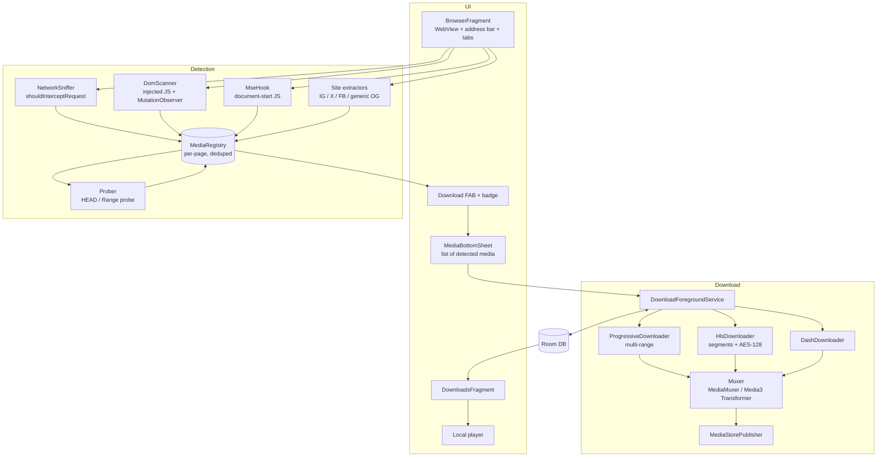

# WebView Video Downloader — Design

A VidMate-style Android app: in-app browser (WebView) that sniffs every video/reel on the
current page and offers one-tap download with quality selection.

Baseline: `com.ms.webview`, minSdk 24, targetSdk 36, AGP 9.3.1, Views (no Compose).

---

## 1. High-level architecture



---

## 2. Detection engine (the hard part)

No single technique catches everything. Four layers feed one registry.

### Layer 1 — Network sniffer

`WebViewClient.shouldInterceptRequest()` fires on a background thread for **every**
subresource. We never block; we observe and return `null`.

Classify by URL/path:

| Kind        | Match                                             |
|-------------|---------------------------------------------------|
| Progressive | `.mp4 .m4v .webm .mkv .mov .3gp .flv`             |
| HLS         | `.m3u8` (master or media playlist)                |
| DASH        | `.mpd`                                            |
| Segment     | `.ts .m4s` — used to *infer* a manifest, not queued directly |
| Ambiguous   | no extension, but host/path looks like a CDN      |

Two things `shouldInterceptRequest` does **not** give you, and both matter:

* **Response `Content-Type`** — not available. For ambiguous URLs, fire an OkHttp
  `HEAD` (falling back to `GET` with `Range: bytes=0-0`, since many CDNs reject HEAD) and
  read `Content-Type` + `Content-Length`.
* **Cookies** — `WebResourceRequest.getRequestHeaders()` omits `Cookie`. Pull it from
  `CookieManager.getInstance().getCookie(url)` at sniff time.

**Capture and persist the request headers with every hit** (`Referer`, `User-Agent`,
`Cookie`, `Origin`). Replaying them at download time is the difference between a working
download and a 403 from the CDN. This is the single most common failure in apps like this.

```java
@Override
public WebResourceResponse shouldInterceptRequest(WebView view, WebResourceRequest req) {
    String url = req.getUrl().toString();
    MediaKind kind = UrlClassifier.classify(url);
    if (kind != MediaKind.NONE) {
        Map<String, String> h = new HashMap<>(req.getRequestHeaders());
        String cookie = CookieManager.getInstance().getCookie(url);
        if (cookie != null) h.put("Cookie", cookie);
        registry.offer(new Hit(pageUrlRef.get(), url, kind, h));  // async, non-blocking
    }
    return null; // never intercept, only observe
}
```

### Layer 2 — DOM scanner

Injected JS, run on `onPageFinished`, re-run on a debounced `MutationObserver` and on
scroll — essential for reel feeds that lazy-load. Collects:

* `document.querySelectorAll('video')` → `currentSrc`, child `<source>`, `poster`,
  `duration`, `videoWidth/Height`
* `meta[property="og:video"]`, `og:video:secure_url`, `twitter:player:stream`
* JSON-LD `VideoObject.contentUrl`
* `<a href>` pointing at media extensions
* same-origin iframes (cross-origin ones still surface via Layer 1)

This layer is what gives us **titles, posters, and durations** — Layer 1 only sees bare
URLs. Correlating the two is what produces a nice VidMate-style card.

Use `WebViewCompat.addWebMessageListener()` (androidx.webkit) with an allowed-origin list
rather than `addJavascriptInterface` — origin-scoped, so a hostile page on another domain
cannot call into your bridge.

### Layer 3 — MSE / blob hook (the one that makes social platforms work)

Instagram, Facebook, X and YouTube play through Media Source Extensions: the `<video>`
element's `src` is `blob:https://…`, which is meaningless to a downloader. Injected at
**document start** (`WebViewCompat.addDocumentStartJavaScript`, guard with
`WebViewFeature.isFeatureSupported(DOCUMENT_START_SCRIPT)`), we monkey-patch:

* `window.fetch` and `XMLHttpRequest.prototype.open/send` — record request URLs and, for
  JSON responses, scan the body for `video_url`, `video_versions`, `playbackUrl`,
  `contentUrl`, `dash_manifest` keys
* `URL.createObjectURL` — map blob URL → the `MediaSource` that produced it
* `MediaSource.prototype.addSourceBuffer` — capture codec strings, so we know the media is
  adaptive and which `<video>` element it belongs to

The segment URLs themselves also appear in Layer 1. Layer 3's real value is (a) tying a
blob-playing element to real network URLs so the card shows the right poster, and (b)
harvesting in-page JSON API responses that carry direct progressive URLs — often a much
better download source than reassembling segments.

### Layer 4 — Site extractors

| Platform | Where the ladder lives |
|----------|------------------------|
| Instagram, **Threads** | `video_dash_manifest` (full ladder), else `video_versions[]` — one reader, identical Meta shape |
| Facebook | `dash_manifest` (full ladder), else `playable_url` + `_quality_hd` |
| X / Twitter | `video_info.variants[]` — one MP4 per bitrate, plus an HLS master |
| TikTok | `bit_rate[]` / `bitrateInfo[]`, one entry per gear; `play_addr` alone otherwise |
| Reddit | `reddit_video` — **manifests only**, see below |
| Vimeo | `request.files.progressive[]`, plus `hls`/`dash` CDN entries |
| Dailymotion | `qualities` map keyed by height, `auto` holding the HLS master |
| Pinterest | `videos.video_list` map keyed by format (`V_720P`, `V_HLSV4`) |
| Twitch | `videoQualities[]` — clips only; VODs need a signed session token |
| Bilibili | `dash.video[]` paired with `dash.audio[]`, else `durl[]` |
| VK | `mp4_240`…`mp4_1080` keys, plus `hls` |
| LinkedIn | `progressiveStreams[]` with exact byte counts, plus `adaptiveStreams[]` |
| IMDb | `playbackURLs[]`, labelled `SD`/`720p` rather than by height |
| Tumblr | video content blocks, else legacy `video_url` |
| Kwai, Likee, Snapchat | one reader — same shape, different spellings |
| ShareChat | best-effort key set |
| Fandom, Flickr, *(any)* | Generic reader: `sources`/`stream`/`progressive` ladders, JW Player's `file`, Flickr's `_content` |

**Reddit takes only the manifests.** `fallback_url` is the obvious pick and what most
downloaders grab, but on any post with sound it is the *video-only* rendition — Reddit keeps
audio in a separate track — so it downloads silent. The DASH and HLS manifests name both, and
both of our manifest paths mux them. Bilibili has the same split and is handled the same way,
pairing each video rung with the best audio track.

Extractors are matched against **both** the page host and the host the response came from — an
embedded Vimeo or Dailymotion iframe on a news site is still Vimeo, and matching only the page
would miss every embed.


Strategy pattern, checked in order, generic fallback last:

```java
public interface SiteExtractor {
    boolean canHandle(Uri pageUrl);
    List<MediaItem> extract(ExtractionContext ctx);  // page URL, html, registry, http client
}
```

Implementations: `InstagramExtractor` (post/reel embedded JSON → `video_versions[]`),
`TwitterExtractor` (`video.twimg.com` m3u8 master + mp4 variants), `FacebookExtractor`,
`GenericOgExtractor`. Site extractors are what make *"detect all reels on a feed page"*
actually work — generic sniffing alone gives you an unlabeled pile of segment URLs.

Keep every extractor behind a **remote-config-updatable list**, because these break
constantly when sites change markup.

### Verification before display

Detection is a pipeline, not a firehose. A URL is published to the sheet only after:

1. **Probe** — HEAD, then a ranged GET, then a retry with relaxed headers. Establishes
   reachability, size, range support, and *which header set the CDN accepts*.
2. **Metadata read** — `MediaMetadataRetriever` opens the stream with those headers and returns
   the true width/height, duration and a decoded frame. A HEAD can never tell us a resolution,
   which is why progressive files used to show only "Original"; and it can never produce a
   preview, which is why only the playing video had a thumbnail.
3. **Gate** — `MediaItem.presentable()` requires a verified variant plus an attempted thumbnail.

The point is that anything tappable has already been fetched successfully once. Half-detected
entries that fail on download are worse than no entry at all. Both steps are budgeted
(150 probes, 30 metadata reads per page) so a feed cannot turn browsing into a crawl.

### Correlation → `MediaRegistry`

Keyed by page URL, cleared on navigation. Responsibilities:

1. **Dedup** by normalized URL.
2. **Group variants** into one `MediaItem` with several `MediaVariant`s. Grouping keys, in
   priority order: same HLS master manifest → same DASH MPD → same base path with only a
   resolution/bitrate token differing → same DOM `<video>` element.
3. **Enrich**: poster, title, duration from Layer 2; size from `Content-Length`
   (progressive) or `bitrate × duration` (adaptive).
4. **Reject DRM**: if an MPD has `<ContentProtection>` or a playlist has
   `#EXT-X-KEY:METHOD=SAMPLE-AES`, mark unavailable and do not offer a download. Widevine
   content is out of scope, deliberately.

```java
class MediaItem {
    String id, pageUrl, title, posterUrl;
    long durationMs;
    List<MediaVariant> variants;   // sorted by height desc
    boolean drmProtected;
}
class MediaVariant {
    String url; MediaKind kind; String mime, codecs;
    int width, height; long bitrate, sizeBytes;
    Map<String,String> headers;   // replayed at download time
    String audioUrl;              // set when video/audio are separate (DASH)
}
```

---

## 3. Download engine

**Foreground service + own executor pool**, not plain WorkManager. WorkManager's execution
window and opaque scheduling fight against pause/resume, live speed reporting and per-chunk
state. Use WorkManager only as a *reschedule-on-connectivity-return* trigger that starts the
service.

* Concurrency: 3 concurrent downloads, 4–8 connections per file, both configurable.
* Notification: one summary + per-download progress, with pause/resume/cancel actions.

### Progressive (MP4/WebM)

Probe `Accept-Ranges: bytes`. If supported, split into N ranges, write into one
preallocated file via `RandomAccessFile` at per-chunk offsets. Persist each chunk's
byte progress to Room on a throttle (~1/sec) so a process kill resumes correctly.
If ranges are unsupported, single stream, resume via `Range: bytes=<downloaded>-`.

### HLS — the primary path

This is where the per-video quality list comes from. A detected `.m3u8` is resolved *at
detection time*, not at download time, so the sheet can show real qualities before the user
commits to anything:

1. `HlsResolver` fetches the master `.m3u8` and expands each `#EXT-X-STREAM-INF` into its own
   `MediaVariant` on the same `MediaItem` — resolution from `RESOLUTION`, bitrate from
   `BANDWIDTH`, separate audio from the `AUDIO` group. The master itself is marked hidden.
2. The cheapest rendition is fetched once to learn the duration; every other quality then gets
   a size estimate from `bandwidth / 8 × duration`, shown with a `~` prefix.
3. At download time `HlsDownloader` re-fetches the chosen media playlist, records every
   segment in Room, and pulls them 4-at-a-time with 3 attempts each.
4. AES-128 segments are decrypted per segment (key cached by URI, IV from `#EXT-X-KEY` or
   derived from the media sequence number). `#EXT-X-MAP` init segments go in at index 0.
5. Segments are concatenated in order and deleted as they are appended, so peak disk stays
   near the final file size.
6. `Remuxer` rewraps to MP4 with `MediaExtractor` → `MediaMuxer`, **no re-encode**.

Refusals are explicit: `SAMPLE-AES` or a non-identity `KEYFORMAT` marks the item DRM-protected
and it appears in the sheet as "Protected"; a playlist with no `#EXT-X-ENDLIST` is a live edge
and is not offered.

### DASH — where Instagram and Facebook keep their quality ladder

A progressive `video_versions` URL is usually a single encode, which is why reels showed one
quality. The `video_dash_manifest` / `dash_manifest` those platforms embed **in their own JSON**
lists every rendition they hold, so it is parsed directly — no fetch, the XML is already there.

In the shape they publish, each `<Representation>` carries a `<BaseURL>` pointing at a complete
file: video-only MP4s alongside a separate audio track. So each video Representation is one
selectable quality, and downloading is two fetches plus a `Remuxer` pass — no segment assembly.
A rendition with no separate audio is reclassified `PROGRESSIVE` and skips the mux entirely.

Manifests built from `SegmentTemplate`/`SegmentList` are recognised and skipped rather than
mis-parsed; assembling those is still outstanding.

### Sibling verification

Strict verification — decode the file before listing it — is what keeps MSE segments out. But
applied per-variant it also discarded alternative qualities whenever the metadata budget ran
short. So one variant per item is proved properly; once `videoConfirmed` is set, its siblings
are alternative encodes of a known-good video and a cheap probe suffices.

### Muxing

`ffmpeg-kit` is the obvious choice and it's what most such apps use, but **it was retired
in January 2025** — no maintained builds, and it adds ~30–40 MB per ABI. Prefer, in order:

1. **`MediaMuxer`** (platform, API 18+) — muxes already-encoded H.264/AAC elementary
   streams into MP4 with no re-encode. Handles the separate-audio-and-video DASH case
   cleanly. Needs a TS demuxer for HLS `.ts` segments.
2. **Media3 `Transformer`** — remux/transmux on-device, handles container conversion, far
   smaller than ffmpeg. Good for HLS→MP4.
3. ffmpeg-kit only if 1 and 2 fail for a format you must support — pin an archived build
   and accept the size.

Fallback if muxing fails: keep the concatenated `.ts`, still playable.

### Storage

Partials → `getExternalFilesDir(DIRECTORY_MOVIES)` (no permission, survives scoped
storage). On completion, publish to `MediaStore.Video`/`Downloads` with `IS_PENDING=1` →
copy → `IS_PENDING=0`. Only pre-Q needs `WRITE_EXTERNAL_STORAGE`. Optional SAF picker for
users who want a custom folder.

---

## 4. Data model (Room)

```
downloads
  id, title, pageUrl, sourceUrl, audioUrl, kind, mime, quality,
  totalBytes, downloadedBytes, filePath, thumbnailPath,
  status (QUEUED|RUNNING|PAUSED|MUXING|COMPLETED|FAILED),
  headersJson, error, createdAt, completedAt
download_chunks
  id, downloadId, index, startByte, endByte, downloadedBytes
hls_segments
  id, downloadId, index, url, keyUri, iv, state
history      id, url, title, favicon, visitedAt
bookmarks    id, url, title, createdAt
```

`headersJson` is not optional — it is how a resumed or retried download avoids a CDN 403.

---

## 5. UI

```
┌──────────────────────────────┐   ┌──────────────────────────────┐
│ ⌂  [ search or url      ] ⋮ │   │  ▁▁▁▁ drag handle ▁▁▁▁       │
├──────────────────────────────┤   │  3 videos found              │
│                              │   ├──────────────────────────────┤
│                              │   │ ▣  Reel · 0:28               │
│         WebView              │   │    1080p 4.2MB ▾   [Download]│
│                              │   ├──────────────────────────────┤
│                        ╭───╮ │   │ ▣  Reel · 1:04               │
│                        │ ⬇ ③│ │   │    720p 8.1MB  ▾   [Download]│
│                        ╰───╯ │   ├──────────────────────────────┤
├──────────────────────────────┤   │        [ Download all ]      │
│  ◀   ▶   ⌂   ▤tabs   ⬇3     │   └──────────────────────────────┘
└──────────────────────────────┘
```

* FAB hidden while registry is empty; slides in with a count badge and a subtle pulse when
  the count changes.
* Quality row is a dropdown of `MediaVariant`s: `1080p · 4.2 MB · mp4`.
* Downloads screen: tabs Active / Completed, swipe-to-delete, tap to play locally
  (Media3 ExoPlayer).

---

## 6. Package layout

```
com.ms.webview
├── ui/browser     BrowserFragment, TabManager, AddressBar, DownloadFab, MediaBottomSheet
├── ui/downloads   DownloadsFragment, adapters
├── ui/player      LocalPlayerActivity (Media3)
├── ui/settings
├── detect         NetworkSniffer, DomScanner, MseHook, MediaRegistry, Prober,
│                  UrlClassifier, extractors/{Instagram,Twitter,Facebook,GenericOg}
├── download       DownloadForegroundService, DownloadManager, ProgressiveDownloader,
│                  HlsDownloader, DashDownloader, HlsParser, MpdParser, Muxer,
│                  MediaStorePublisher, NotificationHelper
├── data           Room entities/DAOs, DownloadRepository, HistoryRepository
└── core           OkHttpProvider, Headers, FileUtils, Result
```

Single `:app` module to start; split `:detect` and `:download` out once they stabilize.

---

## 7. Dependencies to add

| Purpose            | Artifact                                  |
|--------------------|-------------------------------------------|
| WebView extras     | `androidx.webkit:webkit`                  |
| HTTP               | `com.squareup.okhttp3:okhttp`             |
| DB                 | `androidx.room:room-runtime` + compiler   |
| Background         | `androidx.work:work-runtime`              |
| Playback / remux   | `androidx.media3:media3-exoplayer`, `media3-transformer` |
| Images             | `io.coil-kt:coil` or Glide                |
| JSON               | `com.squareup.moshi:moshi` or Gson        |
| Lifecycle          | `androidx.lifecycle:lifecycle-*`          |

---

## 8. Known risks

| Risk | Handling |
|------|----------|
| CDN 403 on replay | Persist and replay Referer/Cookie/UA per URL |
| Blob/MSE-only playback | Layer 3 hook + site extractors |
| Widevine DRM | Detect and refuse — out of scope |
| Site markup changes | Extractors behind remote-updatable config |
| Play Store policy 4.7 | Distribute outside Play, or drop the restricted extractors |
| JS bridge abuse | `addWebMessageListener` with origin allowlist |
| ffmpeg-kit retired | Prefer MediaMuxer / Media3 Transformer |
| Long downloads killed | Foreground service + chunk state in Room |

---

## 9. Milestones

1. ~~**Browser shell**~~ — done.
2. ~~**Detection v1**~~ — done: layers 1 + 2, registry, prober, FAB + bottom sheet.
3. ~~**Progressive downloads**~~ — done: service, multi-range, Room, notifications, MediaStore publish.
4. ~~**HLS**~~ — done: master expansion into qualities, segments, AES-128, remux to MP4.
5. ~~**MSE hook + site extractors**~~ — done: fetch/XHR capture, Instagram/X/Facebook/ShareChat
   extractors, live frame thumbnails, swipeable pager sheet.
6. **Polish** — in-app Media3 player and delete confirmation are done; DASH, settings,
   resume-after-reboot and a tabbed downloads screen remain.
```
